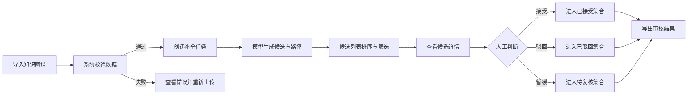

# 可解释知识图谱补全与审核工作台——MVP 产品方案

> 文档版本：V1.0  
> 产品阶段：MVP 方案  
> 技术基础：UBERT-RM 不确定知识图谱补全模型  
> 前置材料：[基于文献的产品定位与需求假设分析](./基于文献的产品定位和需求假设分析.md)  
> 说明：本方案中的用户痛点和产品价值主要来自文献研究，仍需通过原型测试验证。

## 1. 产品概述

### 1.1 产品名称

可解释知识图谱补全与审核工作台。

内部可使用简称：**KG 审核工作台**。

### 1.2 产品定位

面向知识图谱研究人员和知识工程师，提供补全候选生成、模型置信评分、推理路径展示和人工审核能力，帮助用户完成从模型预测到人工确认、结果导出的闭环。

一句话价值主张：

> 将知识图谱补全模型的预测结果转化为可排序、可解释、可审核、可导出的候选事实，辅助用户更高效地维护不完整或含噪的知识图谱。

### 1.3 产品形态

MVP 采用 Web 工作台形态，连接现有 UBERT-RM 推理能力。产品以人工审核为核心，模型负责提供候选、评分和路径证据，用户保留最终决定权。

### 1.4 产品目标

MVP 阶段需要验证三个问题：

1. 候选排序能否减少用户寻找潜在缺失事实的时间。
2. 模型置信评分和关系路径能否帮助用户更快、更准确地判断候选事实。
3. 审核与导出流程能否形成可实际使用的知识图谱维护闭环。

### 1.5 暂不追求的目标

- 不建设通用知识图谱建模和编辑平台。
- 不允许模型预测结果未经人工确认直接写入正式知识图谱。
- 不在首版提供多人权限、审批流和复杂版本管理。
- 不直接进入医疗诊断、金融风控等高风险决策场景。
- 不提供模型训练、超参数配置和算法研究实验管理功能。

## 2. 用户与使用场景

### 2.1 首要用户

| 用户 | 特征 | 主要任务 | 核心诉求 |
|---|---|---|---|
| 知识图谱研究人员 | 熟悉实体、关系、三元组和补全算法 | 分析模型输出、验证预测、比较实验效果 | 看懂预测依据，发现模型在哪些数据上有效或失效 |
| 知识工程师/数据维护人员 | 熟悉图谱数据和维护规范，不一定熟悉模型细节 | 查找缺失事实、审核候选、输出更新数据 | 减少逐条查找成本，保留审核记录，顺利导出结果 |

### 2.2 协作用户

领域专家负责判断候选事实在专业领域内是否成立。他们可能不了解嵌入、注意力或 MRR 等概念，因此界面应使用“候选事实、可信评分、证据路径、来源”等业务语言。

### 2.3 核心任务

当用户拥有一份不完整或带置信信息的知识图谱，希望发现潜在缺失事实时，需要：

1. 导入符合格式要求的数据。
2. 创建补全任务并等待模型生成候选。
3. 优先查看更值得审核的候选事实。
4. 结合评分、路径和邻域信息判断候选是否可信。
5. 接受、驳回或暂缓候选，并保留理由。
6. 导出已审核结果，供后续图谱更新或模型分析使用。

### 2.4 核心需求假设

| 假设 | 当前证据 | MVP 验证重点 |
|---|---|---|
| 用户需要自动生成并排序候选事实 | 知识图谱补全研究及现有模型能力 | 是否提升单位时间审核数量 |
| 用户需要置信信息辅助判断 | KGC 人机协作实验 | 有无评分时的准确率和耗时差异 |
| 用户需要少量关键路径理解预测 | 可解释 KGC 用户研究 | 路径是否有用、是否易懂 |
| 用户需要人工确认，而非自动写入 | 开放世界假设和知识图谱人工评审实践 | 接受、驳回、暂缓是否覆盖实际决策 |
| 用户需要导出结果接入后续流程 | 知识图谱维护流程推断 | 导出字段和格式是否可直接使用 |

## 3. 核心业务流程



核心闭环定义为：

> 导入成功 → 任务运行成功 → 至少审核一条候选 → 导出审核结果。

## 4. MVP 功能范围

### 4.1 功能优先级

| 模块 | 功能 | 优先级 | 纳入 MVP |
|---|---|---:|---:|
| 数据导入 | 上传图谱文件、格式校验、错误提示 | P0 | 是 |
| 补全任务 | 创建任务、查看运行状态、失败重试 | P0 | 是 |
| 候选审核 | 候选列表、排序、基础筛选、分页 | P0 | 是 |
| 结果解释 | 模型置信评分、2–3 条关键路径、邻域信息 | P0 | 是 |
| 人工决策 | 接受、驳回、暂缓、填写备注 | P0 | 是 |
| 结果管理 | 审核进度、状态统计、结果导出 | P0 | 是 |
| 效果分析 | 按关系、分数区间查看接受率 | P1 | 可简化 |
| 批量操作 | 批量接受或驳回 | P1 | 否 |
| 用户协作 | 权限、任务分配、复核审批 | P2 | 否 |
| 图谱管理 | 在线修改实体、关系和模式 | P2 | 否 |
| 生产写入 | 自动同步图数据库 | P2 | 否 |

### 4.2 数据导入

#### 用户目标

确认数据是否满足模型运行要求，避免任务运行后才发现格式问题。

#### 输入要求

MVP 支持 CSV 文件。每行表示一个已有事实，至少包含：

| 字段 | 必填 | 说明 | 示例 |
|---|---:|---|---|
| `head` | 是 | 头实体唯一标识或名称 | 银川 |
| `relation` | 是 | 关系类型 | 位于 |
| `tail` | 是 | 尾实体唯一标识或名称 | 宁夏 |
| `confidence` | 是 | 已有事实的置信信息，范围为 0–1 | 0.92 |
| `source` | 否 | 数据来源 | 数据集A |

#### 校验规则

- 必填字段不得缺失。
- 置信值必须能够转换为 0–1 范围内的数值。
- 空行可以忽略，重复事实需要提示数量。
- 无法识别的关系类型需要明确列出。
- 校验失败时显示错误行、错误原因和修正建议。
- 数据未通过校验前不能创建补全任务。

#### 验收标准

- 用户能够上传合法文件并看到实体数、关系数、事实数和置信度分布摘要。
- 用户上传非法文件后，能够定位具体错误行和字段。
- 修正并重新上传后，无需重新填写任务信息。

### 4.3 补全任务

#### 创建任务

用户填写任务名称，并选择预测目标：

- 给定头实体和关系，预测尾实体；
- 给定头实体和尾实体，预测潜在关系。关系预测可根据模型完成情况决定是否进入首版。

系统保留必要参数，首版不向普通用户暴露模型层数、学习率等算法参数。

#### 任务状态

| 状态 | 含义 | 可执行操作 |
|---|---|---|
| 待运行 | 任务已创建但未开始 | 开始、删除 |
| 运行中 | 模型正在生成候选 | 查看进度 |
| 已完成 | 候选已生成 | 进入审核、导出 |
| 失败 | 数据或模型运行异常 | 查看原因、重试 |

#### 验收标准

- 用户能看见任务状态、创建时间、数据规模和候选数量。
- 运行失败时不能只显示“系统错误”，必须给出可理解的原因和下一步操作。
- 刷新页面后任务状态和进度仍然保留。

### 4.4 候选审核列表

#### 核心字段

| 字段 | 说明 |
|---|---|
| 候选事实 | 头实体—关系—候选尾实体 |
| 模型置信评分 | 模型对候选事实可信程度的输出 |
| 证据路径数 | 系统能够提供的有效推理路径数量 |
| 审核状态 | 未审核、已接受、已驳回、暂缓 |
| 更新时间 | 最近一次操作时间 |

#### 排序和筛选

MVP 默认按模型置信评分从高到低排序，支持：

- 按审核状态筛选；
- 按关系类型筛选；
- 按置信评分区间筛选；
- 按头实体或尾实体关键词搜索。

#### 业务规则

- 界面统一使用“模型置信评分”，不直接称“正确概率”。
- 用户选择筛选条件后，系统显示当前命中数量。
- 返回列表后应保留用户此前的筛选条件和浏览位置。
- 一条候选只能保留一个当前审核状态，但需要保留历史操作记录。

#### 验收标准

- 用户能在候选列表中完成排序、筛选和搜索。
- 用户能够在不进入详情页的情况下识别候选事实及当前状态。
- 筛选结果、总数和审核进度保持一致。

### 4.5 候选详情与路径解释

#### 页面内容

1. 候选事实：突出显示头实体、关系和候选尾实体。
2. 模型置信评分：显示分值，并说明它是模型评分而非事实证明。
3. 关键路径：默认展示排名最高的 2–3 条路径。
4. 路径详情：显示路径上的实体、关系、方向和边置信值。
5. 邻域信息：展示与候选判断直接相关的局部事实。
6. 来源信息：若输入数据包含来源，则随事实一起展示。

#### 展示原则

- 优先使用自然语言关系链，例如“银川—位于→宁夏—属于→中国”。
- 同时提供简化图形视图，头实体和候选尾实体使用固定的强调样式。
- 默认只展示 2–3 条最相关路径，其余路径折叠到“查看更多”。
- 没有有效路径时明确提示“当前候选暂无可用路径证据”，不能伪造解释。
- 路径只作为辅助证据，不使用“证明了该事实”等绝对表达。

#### 验收标准

- 用户能看出每条路径如何连接候选事实的头尾实体。
- 用户能区分候选事实、已有事实和模型生成的证据路径。
- 当路径缺失、关系过长或数据来源缺失时，页面有明确状态说明。

### 4.6 人工审核

#### 审核动作

| 动作 | 适用情况 | 结果 |
|---|---|---|
| 接受 | 用户认为候选事实可以进入后续更新 | 标记为已接受 |
| 驳回 | 用户认为候选事实不成立或不应纳入 | 标记为已驳回 |
| 暂缓 | 当前证据不足，需要补充信息或他人判断 | 标记为暂缓 |

用户可以填写备注。驳回时建议提供预设原因：事实错误、关系错误、实体错误、证据不足、重复事实、其他。

#### 操作规则

- 用户作出决定后自动进入下一条未审核候选。
- 操作后短时间内支持撤销。
- 修改审核状态时保留操作者、时间、原状态和新状态。
- MVP 不提供“一键接受全部高分候选”。

#### 验收标准

- 三种审核动作均可正常保存并实时更新进度。
- 页面刷新后审核状态、备注和历史记录不丢失。
- 用户误操作后可撤销或重新修改状态。

### 4.7 结果导出

#### 导出范围

- 全部候选；
- 仅已接受；
- 仅已驳回；
- 仅暂缓；
- 当前筛选结果。

#### 导出字段

`head`、`relation`、`tail`、`model_score`、`review_status`、`review_reason`、`review_note`、`reviewed_at`、`source`。

若技术实现允许，可额外输出路径编号或路径摘要，以支持结果追溯。

#### 验收标准

- 导出的记录数量与页面显示数量一致。
- 中文、特殊字符和小数不会出现乱码或精度异常。
- 导出文件能够被常见表格软件和后续处理脚本正常读取。

## 5. 信息架构与页面规划

```text
KG 审核工作台
├─ 数据集
│  ├─ 数据集列表
│  └─ 导入与校验
├─ 补全任务
│  ├─ 任务列表
│  ├─ 创建任务
│  └─ 任务详情
├─ 候选审核
│  ├─ 候选列表
│  └─ 候选详情/路径证据
└─ 结果
   ├─ 审核统计
   └─ 结果导出
```

### 5.1 页面清单

| 页面 | 页面目标 | 关键内容 |
|---|---|---|
| 数据导入页 | 完成数据上传和问题修正 | 文件上传、字段说明、校验结果、数据摘要 |
| 任务列表页 | 掌握任务运行和审核情况 | 状态、数据规模、候选数、审核进度 |
| 创建任务页 | 用最少配置启动补全 | 任务名、数据集、预测目标、候选数量设置 |
| 候选审核页 | 连续完成主要审核任务 | 候选列表、筛选、详情、路径、审核按钮 |
| 结果页 | 检查成果并导出 | 状态统计、关系分布、导出范围和格式 |

### 5.2 核心审核页布局建议

```text
┌──────────────────────────────────────────────────────────────┐
│ 任务名称   已审核 42/100   [关系筛选] [评分区间] [状态]      │
├───────────────────────┬──────────────────────────────────────┤
│ 候选列表              │ 候选详情                             │
│                       │                                      │
│ 头实体-关系-尾实体    │ 候选事实                             │
│ 模型评分 / 状态       │ 模型置信评分及说明                   │
│                       │                                      │
│ 当前候选高亮          │ 路径1：A → B → C                    │
│                       │ 路径2：A → D → C                    │
│                       │ 路径3：A → E → C                    │
│                       │ [查看邻域和来源]                     │
│                       │                                      │
│                       │ [驳回] [暂缓] [接受]                 │
│                       │ 备注：________________________       │
└───────────────────────┴──────────────────────────────────────┘
```

候选列表和证据详情采用同页布局，可以减少反复跳转，便于用户连续审核。

## 6. 关键产品规则

### 6.1 评分规则

- 模型分数保留统一的小数位数，例如三位。
- 排序使用原始精度，显示值仅用于阅读。
- 在完成概率校准前，禁止使用“90% 正确”等表达。
- 评分只影响默认排序，不替代人工决定。

### 6.2 路径规则

- 默认显示与当前候选最相关的 2–3 条有效路径。
- 路径排序需综合语义相关性和路径可靠性，具体算法沿用模型输出。
- 路径长度、边置信值和路径评分需要可查看，但不能淹没主要判断信息。
- 同一条路径不得重复展示。

### 6.3 审核规则

- 未审核候选不得作为正式补全结果导出，除非用户明确选择“导出全部候选”。
- 已接受表示通过本次人工审核，不等于已经写入生产知识图谱。
- 暂缓候选保留在待复核列表中。
- 每次状态变更都要生成审核日志。

### 6.4 异常处理

| 异常 | 产品处理 |
|---|---|
| 文件格式错误 | 指出错误字段和行号，提供正确示例 |
| 任务运行失败 | 展示失败阶段、可理解原因和重试入口 |
| 没有生成候选 | 说明可能原因，允许调整任务或更换数据 |
| 候选没有路径 | 仍允许审核，明确说明路径证据缺失 |
| 页面或网络异常 | 保存已完成操作，恢复后继续当前进度 |
| 导出失败 | 保留导出条件并支持重新导出 |

## 7. 非功能要求

### 7.1 易用性

- 用户第一次进入页面时提供简短任务引导和示例数据。
- 页面避免直接暴露不必要的算法参数和公式。
- 关键术语提供悬浮说明，如“模型置信评分”和“路径证据”。

### 7.2 性能

- 普通列表筛选、翻页和状态切换应在用户可感知的短时间内完成。
- 长时间模型任务必须异步执行，并持续显示状态。
- 用户离开页面后任务继续运行。

### 7.3 可追溯性

- 保存数据集、模型版本、任务参数和任务运行时间。
- 保存每条候选的评分、路径、审核结果及变更记录。
- 导出结果能够追溯到对应任务。

### 7.4 数据安全

- MVP 使用测试数据或已获授权的数据。
- 上传文件、任务产物和导出文件按任务隔离。
- 日志中避免记录不必要的敏感原始内容。

## 8. MVP 验证方案

### 8.1 验证对象

优先招募 5 名左右具备知识图谱经验的研究生、研究人员或工程人员。若使用专业领域数据，则参与者需具备相应领域知识。

### 8.2 测试材料

- 选取 30 条左右人类能够理解和核验的候选事实。
- 候选中应包含正确、错误和证据不足的情况。
- 为每条候选准备参考答案或由两名以上评审者独立标注。
- 避免只使用模型高分且容易判断的样本。

### 8.3 对照条件

| 条件 | 用户可见信息 | 验证目的 |
|---|---|---|
| A | 候选事实 | 建立纯人工判断基线 |
| B | 候选事实＋模型置信评分 | 验证评分的作用 |
| C | 候选事实＋评分＋2–3 条路径 | 验证路径解释的增量价值 |

同一参与者使用三种条件时，应调整题目顺序，减少学习和记忆带来的偏差。

### 8.4 指标

#### 主指标

**单位时间内正确完成审核的候选数量。**

计算方式：正确审核数量 ÷ 实际审核时间。

#### 辅助指标

- 单条候选平均审核时间；
- 审核准确率；
- 暂缓率；
- 用户判断信心；
- 路径解释有用性评分；
- 用户是否理解模型评分的含义；
- 审核者之间的一致性；
- 任务完成率和关键操作错误数。

### 8.5 建议成功标准

以下数值作为 MVP 是否值得继续迭代的建议阈值，并非已经实现的结果：

- 条件 C 的单位时间正确审核数量比条件 A 提升至少 20%；
- 条件 C 的审核准确率不低于条件 A，或下降不超过 2 个百分点；
- 至少 4/5 用户能够独立完成导入、审核和导出闭环；
- 至少 4/5 用户能够正确解释“模型置信评分不等于事实正确概率”；
- 路径解释有用性平均达到 5 分制中的 3.5 分；
- 没有路径时，用户仍能理解并完成暂缓或其他审核动作。

## 9. 产品与模型指标体系

| 层级 | 指标 | 用途 |
|---|---|---|
| 模型效果 | MRR、Hits@K | 衡量候选排序表现 |
| 置信预测 | MSE、MAE | 衡量模型分数与标签差异 |
| 评分可信性 | ECE、Brier Score、可靠性图 | 判断分数是否经过合理校准 |
| 审核质量 | 准确率、一致性、接受后抽检错误率 | 衡量人工结果质量 |
| 审核效率 | 单条耗时、单位时间正确审核量 | 衡量产品是否节省工作量 |
| 解释价值 | 有用性评分、路径展开率、判断信心变化 | 衡量路径是否帮助用户 |
| 流程体验 | 任务完成率、错误数、导出成功率 | 衡量工作台可用性 |

MVP 不使用日活、留存等通用互联网指标作为主要判断依据。当前更重要的是证明产品能否帮助目标用户完成一个低频但专业的工作任务。

## 10. 依赖与风险

| 风险/依赖 | 影响 | 应对方案 |
|---|---|---|
| UBERT-RM 尚未形成稳定推理接口 | 工作台无法实时生成候选 | 首版可先使用离线推理结果完成交互验证，再接入接口 |
| 模型分数未经概率校准 | 用户可能误解分数 | 统一称模型评分，增加说明，并补充校准实验 |
| 公开数据难以人工理解 | 用户测试无法可靠判断 | 选择可解释子集，或构造小规模领域样本并建立参考答案 |
| 路径过长或过多 | 增加认知负担 | 默认展示 2–3 条，限制首屏信息量 |
| 目标用户数量较少 | 难以开展大规模调研 | 先做小样本任务实验，结合操作数据和访谈分析 |
| 算法效果与产品价值不一致 | 离线指标高但审核无提升 | 以单位时间正确审核量作为主验证指标 |

## 11. 实施阶段

| 阶段 | 主要产出 | 完成标准 |
|---|---|---|
| 方案阶段 | MVP 产品方案 | 范围、规则、页面和指标明确 |
| 原型阶段 | 业务流程图、信息架构、低保真原型 | 核心闭环可点击演示 |
| 验证阶段 | 用户测试记录与验证报告 | 完成三种条件对照并输出结论 |
| 设计阶段 | 高保真原型、交互说明 | 关键状态和异常场景齐全 |
| 开发阶段 | 可运行 Demo | 能导入、审核并导出一组真实模型结果 |
| 复盘阶段 | 产品案例与迭代规划 | 明确验证、证伪和下一版需求 |

## 12. MVP 完成定义

当以下条件全部满足时，可以认为 MVP 已形成：

- 至少支持一种规范的数据文件导入并完成校验；
- 能通过真实模型或离线模型结果生成候选任务；
- 候选列表可排序、筛选和搜索；
- 每条候选能够展示模型评分和最多 2–3 条关键路径；
- 用户可以接受、驳回或暂缓候选并保留记录；
- 审核结果能够以结构化文件导出；
- 至少完成一轮目标用户任务测试；
- 验证报告明确哪些需求得到支持、哪些被否定、哪些仍不确定。

