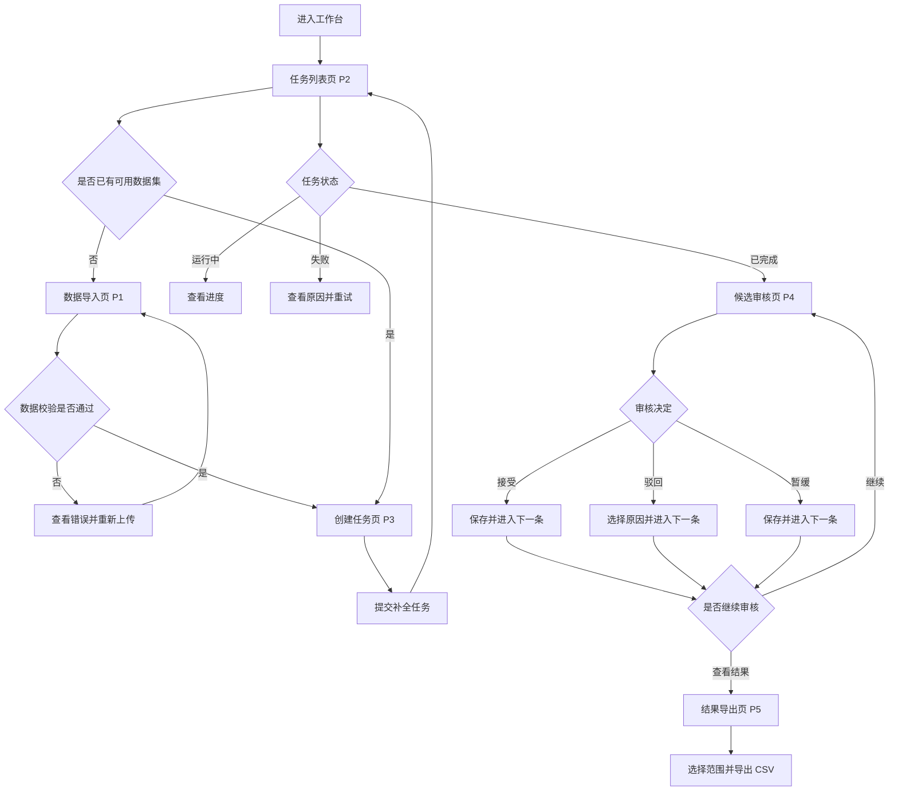
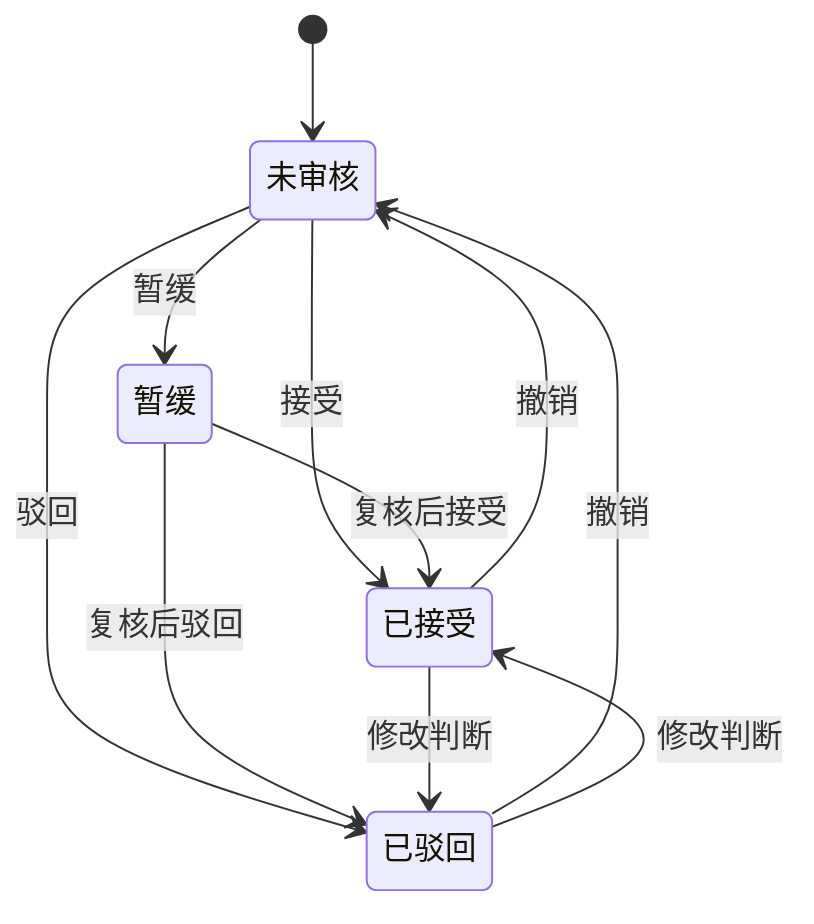
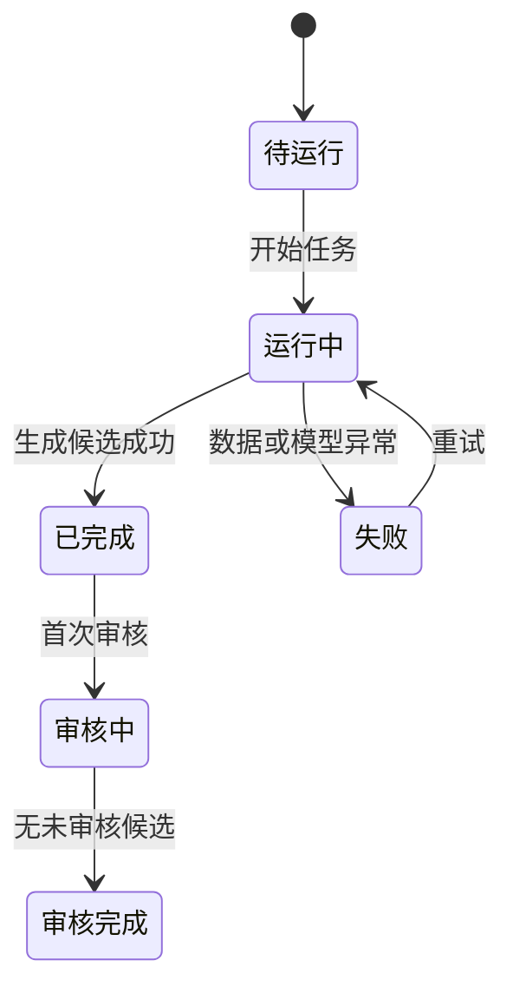

# 可解释知识图谱补全与审核工作台——页面流程与低保真原型说明

> 文档版本：V1.0  
> 前置方案：[MVP 产品方案](./可解释知识图谱补全与审核工作台-MVP产品方案.md)  
> 文档用途：将产品方案转化为可评审、可画原型、可进行用户测试的页面设计依据。

## 1. 这份产出的作用

页面流程与低保真原型位于“产品方案”和“视觉设计/开发”之间，主要解决三个问题：

1. **验证流程是否完整**：检查用户能否从数据导入一直走到结果导出，是否存在断点、重复操作或缺失状态。
2. **验证核心需求是否可用**：用较低成本测试用户能否理解模型评分、推理路径以及接受、驳回、暂缓等操作。
3. **统一后续协作标准**：为高保真设计、PRD、前端开发、接口设计和用户测试提供相同的页面与交互基线。

低保真原型关注信息、操作和流程，不讨论品牌、配色、字体和精细视觉效果。当前阶段如果直接制作高保真界面，后续一旦核心流程被用户否定，修改成本会更高。

本产出最终应帮助团队回答：

> 用户能否在不理解 UBERT-RM 算法细节的情况下，找到候选事实、理解辅助证据、作出审核决定并导出结果？

## 2. 原型验证目标

本轮原型重点验证四项内容：

- 用户是否理解“候选事实”和“模型置信评分”。
- 用户是否能看懂关系路径如何连接头实体和候选尾实体。
- 用户是否能区分接受、驳回和暂缓三种审核状态。
- 用户是否能独立完成导入、创建任务、审核和导出闭环。

本轮不验证：

- 视觉风格是否美观；
- 模型训练配置是否合理；
- 多人协作和审批权限；
- 自动写入正式知识图谱；
- 复杂图谱编辑能力。

## 3. 页面信息架构

```text
KG 审核工作台
├─ 数据集
│  ├─ 数据集列表
│  └─ 数据导入与校验
├─ 补全任务
│  ├─ 任务列表
│  └─ 创建任务
├─ 候选审核
│  ├─ 候选列表
│  └─ 候选详情与路径证据
└─ 审核结果
   ├─ 结果统计
   └─ 结果导出
```

MVP 只设计以下 5 个核心页面：

| 编号 | 页面 | 用户要完成的任务 |
|---|---|---|
| P1 | 数据导入页 | 上传并检查知识图谱数据 |
| P2 | 任务列表页 | 查看任务状态和进入审核 |
| P3 | 创建任务页 | 选择数据集并发起补全任务 |
| P4 | 候选审核页 | 查看候选、评分和路径，作出决定 |
| P5 | 结果导出页 | 检查审核成果并导出文件 |

候选详情与路径证据不单独设计页面，而是放在候选审核页右侧，减少连续审核时的页面跳转。

## 4. 核心页面流程



### 4.1 最短成功路径

```text
上传合法数据
→ 创建任务
→ 等待任务完成
→ 进入候选审核
→ 查看评分与路径
→ 接受/驳回/暂缓
→ 查看结果
→ 导出 CSV
```

### 4.2 异常恢复路径

```text
数据校验失败 → 定位错误行 → 修正并重新上传
任务运行失败 → 查看失败原因 → 重试任务
候选没有路径 → 查看邻域和来源 → 暂缓或继续判断
审核操作错误 → 撤销 → 恢复上一状态
导出失败 → 保留导出条件 → 重新导出
```

## 5. 全局页面结构

所有页面使用统一的工作台框架：

```text
┌─────────────────────────────────────────────────────────────┐
│ KG 审核工作台                      帮助   当前用户           │
├──────────────┬──────────────────────────────────────────────┤
│ 数据集       │                                              │
│ 补全任务     │                当前页面内容                  │
│ 候选审核     │                                              │
│ 审核结果     │                                              │
│              │                                              │
└──────────────┴──────────────────────────────────────────────┘
```

全局规则：

- 左侧导航保持固定，当前位置高亮。
- 页面主操作放在右上角，例如“导入数据”“创建任务”“导出结果”。
- 成功、警告和失败使用文字加图标共同表达，不能只依赖颜色。
- 长时间运行的任务通过状态和进度反馈，不阻塞整个页面。
- 用户已设置的筛选条件和列表位置应尽量保留。

## 6. P1 数据导入页

### 6.1 页面目标

帮助用户完成文件上传、字段映射和数据校验，确认数据可以用于补全任务。

### 6.2 低保真线框

```text
┌─────────────────────────────────────────────────────────────┐
│ 数据导入                                     [下载示例文件] │
│ 上传知识图谱数据，并在创建任务前完成格式检查                │
├─────────────────────────────────────────────────────────────┤
│ ① 上传文件                                                  │
│ ┌─────────────────────────────────────────────────────────┐ │
│ │ 拖拽 CSV 到此处，或 [选择文件]                          │ │
│ │ 必填字段：head / relation / tail / confidence           │ │
│ └─────────────────────────────────────────────────────────┘ │
│                                                             │
│ ② 字段识别                                                  │
│ 头实体 [head ▼]  关系 [relation ▼]  尾实体 [tail ▼]         │
│ 置信值 [confidence ▼]  来源 [source ▼/可选]                  │
│                                                             │
│ ③ 校验结果                                                  │
│ ✓ 15,000 个实体  ✓ 36 种关系  ✓ 241,158 条事实             │
│ ⚠ 12 条重复记录   ✕ 3 条置信值超出 0–1                    │
│ [查看错误明细]                                              │
│                                                             │
│                                  [取消] [重新校验] [确认导入]│
└─────────────────────────────────────────────────────────────┘
```

### 6.3 关键交互

- 选择文件后自动识别字段，并允许用户调整字段映射。
- 校验结果按“通过、警告、错误”分组。
- 错误明细显示行号、字段、当前值和修正建议。
- 存在错误时禁用“确认导入”；只有警告时允许继续，但需说明影响。
- 导入成功后引导用户“立即创建任务”或“返回数据集列表”。

### 6.4 需要覆盖的状态

- 初始空状态；
- 文件上传中；
- 校验通过；
- 仅有警告；
- 校验失败；
- 文件无法解析；
- 导入成功。

## 7. P2 任务列表页

### 7.1 页面目标

帮助用户了解所有补全任务的运行状态、候选数量和审核进度，并快速进入下一步。

### 7.2 低保真线框

```text
┌─────────────────────────────────────────────────────────────┐
│ 补全任务                                         [创建任务] │
├─────────────────────────────────────────────────────────────┤
│ [全部状态 ▼] [数据集 ▼] [搜索任务名称____________]          │
├─────────────────────────────────────────────────────────────┤
│ 任务名称       数据集     状态      候选数   审核进度   操作 │
│ CN15K补全01    CN15K      已完成    1,000    42%       [审核]│
│ NL27K补全01    NL27K      运行中    --       --        [进度]│
│ 测试任务03     Test       失败      --       --        [详情]│
│                                                             │
│ 第 1–3 条，共 3 条                              [上一页][下页]│
└─────────────────────────────────────────────────────────────┘
```

### 7.3 关键交互

- 已完成任务的主操作为“开始审核”或“继续审核”。
- 运行中任务显示当前阶段和进度，不显示虚假的精确剩余时间。
- 失败任务显示简短原因，展开后提供详细信息和“重新运行”。
- 审核完成的任务主操作变为“查看结果”。
- 空列表状态提供“导入数据”和“创建任务”两个引导入口。

### 7.4 状态与主操作

| 状态 | 列表反馈 | 主操作 |
|---|---|---|
| 待运行 | 等待开始 | 开始任务 |
| 运行中 | 当前阶段和进度 | 查看进度 |
| 已完成、未审核 | 候选数量 | 开始审核 |
| 已完成、审核中 | 审核百分比 | 继续审核 |
| 审核完成 | 接受/驳回/暂缓数量 | 查看结果 |
| 失败 | 失败原因摘要 | 查看详情/重试 |

## 8. P3 创建任务页

### 8.1 页面目标

让用户用最少配置创建补全任务，避免暴露不必要的算法参数。

### 8.2 低保真线框

```text
┌─────────────────────────────────────────────────────────────┐
│ 创建补全任务                                                │
├─────────────────────────────────────────────────────────────┤
│ 任务名称 *                                                  │
│ [CN15K 尾实体补全测试____________________________]          │
│                                                             │
│ 选择数据集 *                                                │
│ [CN15K / 15,000实体 / 36关系 / 241,158事实 ▼]              │
│                                                             │
│ 预测目标 *                                                  │
│ ● 给定头实体和关系，预测尾实体                              │
│ ○ 给定头实体和尾实体，预测关系（如首版支持）                │
│                                                             │
│ 每个查询生成候选数                                          │
│ [10 ▼]  说明：候选越多，后续审核量越大                     │
│                                                             │
│ 数据与模型摘要                                              │
│ 数据集：CN15K   模型：UBERT-RM v1   输出：评分＋路径         │
│                                                             │
│                                      [取消] [创建并开始运行] │
└─────────────────────────────────────────────────────────────┘
```

### 8.3 关键交互

- 默认使用推荐配置，隐藏学习率、模型层数等研究参数。
- 切换数据集后自动更新数据摘要和可用预测目标。
- 提交前显示预计生成的最大候选数量，帮助用户理解工作量。
- 创建成功后返回任务列表，并将新任务置顶显示。
- 数据集不满足模型要求时禁止提交，并说明缺少的内容。

## 9. P4 候选审核页

### 9.1 页面目标

这是 MVP 的核心页面。用户在同一页面完成候选定位、证据理解、审核判断和连续处理。

### 9.2 低保真线框

```text
┌────────────────────────────────────────────────────────────────────┐
│ CN15K补全01   已审核 42/100   正确参考：测试时隐藏   [查看结果]    │
├──────────────────────────┬─────────────────────────────────────────┤
│ [关系▼][评分▼][状态▼]    │ 候选事实                                │
│ [搜索实体__________]     │ 银川 ── 位于 ──> 宁夏                  │
│                          │                                         │
│ ● 银川-位于-宁夏         │ 模型置信评分  0.923  [?评分是什么]      │
│   0.923  未审核          │ “表示模型相对信心，不等于事实正确概率” │
│                          │                                         │
│ ○ A-关系1-B              │ 关键路径（默认展示 3 条）               │
│   0.881  已接受          │ ① 银川 → 宁夏首府 → 宁夏               │
│                          │    路径评分 0.90   [展开边详情]          │
│ ○ C-关系2-D              │ ② 银川 → 所属地区 → 宁夏               │
│   0.764  暂缓            │    路径评分 0.84   [展开边详情]          │
│                          │ ③ 银川 → 中国城市 → 宁夏               │
│ [上一页]  1/10 [下一页]  │    路径评分 0.78   [展开边详情]          │
│                          │ [查看更多路径] [查看邻域与来源]          │
│                          │                                         │
│                          │ 备注 [______________________________]   │
│                          │                                         │
│                          │ [驳回 ▼]       [暂缓]       [接受]       │
└──────────────────────────┴─────────────────────────────────────────┘
```

### 9.3 信息优先级

从高到低依次为：

1. 候选事实；
2. 审核动作；
3. 模型置信评分及其含义；
4. 2–3 条关键路径；
5. 邻域、来源和完整路径细节；
6. 模型版本等追溯信息。

### 9.4 核心交互

- 用户在左侧选择候选，右侧立即更新详情。
- 点击路径可展开每条边的关系方向、置信值和来源。
- 接受后保存状态，并自动定位下一条未审核候选。
- 驳回时展开原因选项：事实错误、关系错误、实体错误、证据不足、重复事实、其他。
- 暂缓允许不填写原因，但提示可以添加备注供复核。
- 操作后显示“已保存，撤销”提示。
- 返回页面时保留筛选条件、当前页和最近查看的候选。

### 9.5 无路径状态

```text
┌─────────────────────────────────────────────────────────────┐
│ 路径证据                                                    │
│                                                             │
│ 当前候选暂无可用路径证据                                    │
│ 你仍可结合模型评分、邻域和来源信息作出判断。                │
│                                                             │
│ [查看邻域信息] [查看来源]                                   │
└─────────────────────────────────────────────────────────────┘
```

无路径时不能隐藏整个证据区域，否则用户可能误以为页面加载失败。

### 9.6 审核完成状态

```text
┌─────────────────────────────────────────────────────────────┐
│ 本批候选已全部审核完成                                      │
│ 已接受 56 条｜已驳回 32 条｜暂缓 12 条                     │
│                                                             │
│ [复核暂缓项] [查看审核结果] [导出结果]                      │
└─────────────────────────────────────────────────────────────┘
```

## 10. P5 结果导出页

### 10.1 页面目标

让用户确认审核成果、发现异常分布，并按需要导出结构化结果。

### 10.2 低保真线框

```text
┌─────────────────────────────────────────────────────────────┐
│ 审核结果                                      [导出结果]    │
├─────────────────────────────────────────────────────────────┤
│ 任务：CN15K补全01                                            │
│ 审核进度：100 / 100                                         │
│                                                             │
│ ┌──────────┐ ┌──────────┐ ┌──────────┐ ┌──────────┐        │
│ │ 已接受56 │ │ 已驳回32 │ │ 暂缓12   │ │ 未审核0  │        │
│ └──────────┘ └──────────┘ └──────────┘ └──────────┘        │
│                                                             │
│ [状态▼] [关系▼] [评分区间▼] [搜索实体__________]            │
│                                                             │
│ 候选事实          评分     状态     原因        审核时间     │
│ 银川-位于-宁夏    0.923    接受     --          10:32        │
│ A-关系1-B         0.881    驳回     关系错误    10:35        │
│                                                             │
│ 导出范围：○全部  ●当前筛选  ○仅已接受  ○仅暂缓             │
│ 导出格式：●CSV                                              │
│                                         [取消] [确认导出]    │
└─────────────────────────────────────────────────────────────┘
```

### 10.3 关键交互

- 统计卡片可点击，并作为审核状态筛选条件。
- 导出前展示预计导出条数和字段。
- “仅已接受”是后续图谱更新最常用范围，但首次进入不应默认触发下载。
- 导出完成后显示文件名、记录数量和生成时间。
- 暂缓数量大于零时提示用户可以先复核，但不阻止导出其他结果。

## 11. 关键状态流转

### 11.1 候选审核状态



每次状态变化都记录操作时间、原状态、新状态、原因和备注。

### 11.2 任务状态



## 12. 原型制作要求

### 12.1 原型保真度

建议先制作灰度低保真可点击原型：

- 使用真实字段名称和接近真实的数据；
- 保持清晰的信息层级和按钮位置；
- 不投入大量时间制作插画、品牌色和精细图表；
- 所有核心按钮都应有跳转或状态反馈；
- 至少覆盖一条成功路径和主要异常路径。

### 12.2 必须可点击的交互

1. 上传文件并查看校验结果；
2. 创建补全任务；
3. 从任务列表进入审核；
4. 切换不同候选；
5. 展开一条推理路径；
6. 完成接受、驳回和暂缓；
7. 撤销一次审核操作；
8. 查看无路径候选；
9. 进入结果页并选择导出范围；
10. 完成导出反馈。

### 12.3 原型示例数据

原型中至少准备 8–10 条候选：

- 高分且有清晰路径的候选；
- 高分但事实错误的候选；
- 低分但可能正确的候选；
- 没有有效路径的候选；
- 重复事实；
- 关系或实体容易混淆的候选；
- 需要暂缓并补充资料的候选。

这样可以避免原型只展示理想状态，无法检验用户是否会盲从评分。

## 13. 原型评审清单

制作完成后，应在内部评审中逐项检查：

- 用户是否始终知道自己正在处理哪个任务；
- 候选事实是否比模型信息更突出；
- “模型置信评分”是否有明确解释；
- 路径是否真正连接候选事实中的实体；
- 用户是否可以在没有路径时继续判断；
- 接受、驳回、暂缓是否容易区分；
- 误操作后是否可以恢复；
- 审核进度和结果数量是否一致；
- 导出范围和字段是否清楚；
- 所有空状态、失败状态和完成状态是否有下一步入口。

## 14. 与后续产出的关系

```text
MVP 产品方案
  ↓ 明确做什么、为何做
页面流程与低保真原型说明（当前文档）
  ↓ 明确页面如何承载功能、用户如何操作
可点击低保真原型
  ↓ 提供实际测试材料
原型用户测试方案与测试记录
  ↓ 验证需求假设和交互设计
需求验证报告
  ↓ 决定保留、修改或删除哪些功能
正式 PRD 与高保真设计
  ↓ 进入开发与演示 Demo
```

这份说明不是最终界面设计稿。它的主要价值是把抽象需求转化为可以被用户操作和被团队评审的流程，尽早发现产品方向、信息层级和交互逻辑中的问题。

